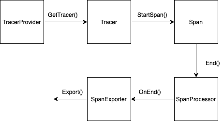
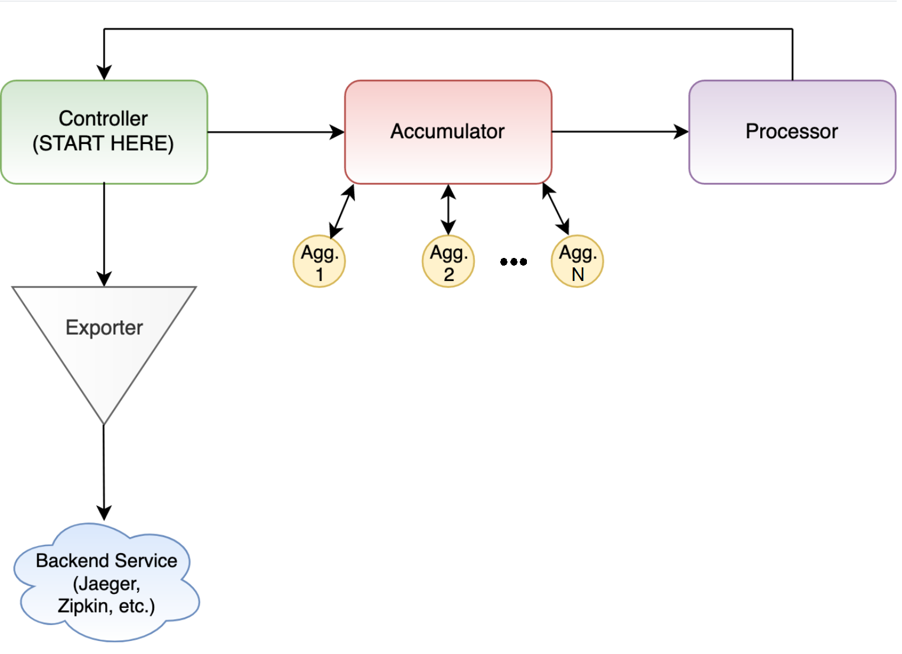

# StreamExporter Design

In strongly typed languages typically there will be 2 separate `Exporter` interfaces, one that accepts spans from a tracer (SpanExporter) and one that accepts metrics (MetricsExporter)

The exporter SHOULD be called with a checkpoint of finished (possibly dimensionally reduced) export records. Most configuration decisions have been made before the exporter is invoked, including which instruments are enabled, which concrete aggregator types to use, and which dimensions to aggregate by.

## Use Cases

Monitoring and alerting systems commonly use the data provided through metric events or tracers, after applying various aggregations and converting into various exposition format. After getting the data, the systems need to be able to see the data. The StreamExporter will be used here to print data through an ostream, this is seen as a simple exporter where the user doesn’t have the burden of implementing or setting up a protocol dependent exporter.

The StreamExporter will also be used as a debugging tool for the Metrics API/SDK and Tracing API/SDK which are currently work in progress projects. This exporter will allow contributors to easily diagnose problems when working on the project.

## Push vs Pull Exporter

There are two different versions of exporters: Push and Pull. A Push Exporter pushes the data outwards towards a system, in the case of the StreamExporter it sends its data into an ostream. A Pull Exporter exposes data to some endpoint for another system to grab the data. 

The StreamExporter will only be implementing a Push Exporter framework.

## Design Tenets

* Reliability
    * The Exporter should be reliable; data exported should always be accounted for. The data will either all be successfully exported to the destination server, or in the case of failure, the data is dropped. `Export` will always return failure or success to notify the user of the result.
    * Thread Safety
        * Export() should never be called concurrently. This is handled by the controller in the StreamMetricsExporter.
* Scalability
    * The Exporter must be able to operate on sizeable systems with predictable overhead growth.  A key requirement of this is that the library does not consume unbounded memory resource. 
* Security
    * StreamExporter should only be used for development and testing purpose, where security and privacy is less a concern as it doesn't communicate to external systems.

## SpanExporter

`Span Exporter` defines the interface that protocol-specific exporters must implement so that they can be plugged into OpenTelemetry SDK and support sending of telemetry data.

The goal of the interface is to minimize burden of implementation for protocol-dependent telemetry exporters. The protocol exporter is expected to be primarily a simple telemetry data encoder and transmitter.

The SpanExporter is called through the SpanProcessor, which passes finished spans to the configured SpanExporter, as soon as they are finished. The SpanProcessor also shutdown the exporter by the Shutdown function within the SpanProcessor.



The specification states: exporter must support two functions: Export and Shutdown.


### `Export(span of recordables)`

Exports a batch of telemetry data. Protocol exporters that will implement this function are typically expected to serialize and transmit the data to the destination.

Export() will never be called concurrently for the same exporter instance. Export() can be called again only after the current call returns.

Export() must not block indefinitely. We can rely on printing to an ostream is reasonably performant and doesn't block.

The specification states: Any retry logic that is required by the exporter is the responsibility of the exporter. The default SDK SHOULD NOT implement retry logic, as the required logic is likely to depend heavily on the specific protocol and backend the spans are being sent to.

### `Shutdown()`

Shuts down the exporter. Called when SDK is shut down. This is an opportunity for exporter to do any cleanup required.

`Shutdown` should be called only once for each `Exporter` instance. After the call to `Shutdown` subsequent calls to `Export` are not allowed and should return a `Failure` result.

`Shutdown` should not block indefinitely (e.g. if it attempts to flush the data and the destination is unavailable). Language library authors can decide if they want to make the shutdown timeout configurable.

In the StreamExporter there is no cleanup to be done, so there is no need to use the timeout within the `Shutdown` function as it will never be blocking. 

```
class StreamSpanExporter final : public sdktrace::SpanExporter
{

private: 
    bool isShutdown = false;
    
public:
    /* 
        This function should never be called concurrently.
    */ 
    sdktrace::ExportResult Export(
        const nostd::span<std::unique_ptr<sdktrace::Recordable>> &spans) noexcept
    {
        
        if(isShutdown)
        {
            return sdktrace::ExportResult::kFailure;
        }
    
        for (auto &recordable : spans)
        {
            auto span = std::unique_ptr<sdktrace::SpanData>(
                static_cast<sdktrace::SpanData *>(recordable.release()));
        
            if (span != nullptr)
            {
                char trace_id[32]       = {0};
                char span_id[16]        = {0};
                char parent_span_id[16] = {0};
        
                span->GetTraceId().ToLowerBase16(trace_id);
                span->GetSpanId().ToLowerBase16(span_id);
                span->GetParentSpanId().ToLowerBase16(parent_span_id);
        
                std::cout << "{"
                          << "\n  name          : " << span->GetName()
                          << "\n  trace_id      : " << std::string(trace_id, 32)
                          << "\n  span_id       : " << std::string(span_id, 16)
                          << "\n  parent_span_id: " << std::string(parent_span_id, 16)
                          << "\n  start         : " << span->GetStartTime().time_since_epoch().count()
                          << "\n  duration      : " << span->GetDuration().count() 
                          << "\n  description   : " << span->GetDescription() 
                          << "\n  status        : " << span->GetStatus()
                          << "\n  attributes    : " << span->GetAttributes() << "\n}"
                          << "\n";
            }

        }
    
        return sdktrace::ExportResult::kSuccess;
    }

    void Shutdown(std::chrono::microseconds timeout = std::chrono::microseconds(0)) noexcept
    {
        isShutdown = true;
    }

};


```

## MetricsExporter

The MetricsExporter has the same requirements as the SpanExporter. The exporter will go through the different metric instruments and send the value stored in their aggregators to an ostream, for simplicity only Counter is shown here, but all aggregators will be implemented. Counter, Gauge, MinMaxSumCount, Sketch, Histogram and Exact Aggregators will be supported.

Exports a batch of telemetry data. Protocol exporters that will implement this function are typically expected to serialize and transmit the data to the destination.



### `Export(batch of Records)`

Export() will never be called concurrently for the same exporter instance. Export() can be called again only after the current call returns.

Export() must not block indefinitely. We can rely on printing to an ostream is reasonably performant and doesn't block.

The specification states: Any retry logic that is required by the exporter is the responsibility of the exporter. The default SDK SHOULD NOT implement retry logic, as the required logic is likely to depend heavily on the specific protocol and backend the spans are being sent to.

The MetricsExporter is called through the Controller in the SDK data path. The exporter will either be called on a regular interval in the case of a push controller or through manual calls in the case of a pull controller.

### `Shutdown()`

Shuts down the exporter. Called when SDK is shut down. This is an opportunity for exporter to do any cleanup required.

`Shutdown` should be called only once for each `Exporter` instance. After the call to `Shutdown` subsequent calls to `Export` are not allowed and should return a `Failure` result.

`Shutdown` should not block indefinitely (e.g. if it attempts to flush the data and the destination is unavailable). Language library authors can decide if they want to make the shutdown timeout configurable.

In the StreamExporter there is no cleanup to be done, so there is no need to use the timeout within the `Shutdown` function as it will never be blocking.

```
class StreamMetricsExporter final : public sdkmeter::MetricsExporter
{

private: 
    bool isShutdown = false;
    
public:
    sdkmeter::ExportResult Export(
        const Collection<Record> batch) noexcept
    {
            
        if(isShutdown)
        {
            return sdktrace::ExportResult::kFailure;
        }
       
        for (auto &metric : batch)
        {
                            
            if (metric != nullptr)
            {
        
                if(metric.AggregationType == CounterAggregator) {
                    std::cout << "{"
                              << "\n  name          : " << metric->GetName()
                              << "\n  labels        : " << metric->GetLabels()
                              << "\n  sum           : " << metric->Value[0] << "\n}"
                }
                else if(metric.AggregationType == SketchAggregator) {
                    // Similarly print data
                }
                // Other Aggreagators will also be handeled,
                // Counter, Gauge, MinMaxSumCount, Sketch, Histogram,
                // and Exact Aggreagtors        
            }

        }
    
        return sdkmeter::ExportResult::kSuccess;
    }

    void Shutdown(microseconds timeout = microseconds(0)) noexcept
    {
        isShutdown = true;
    }
};
```

## Test Strategy / Plan

In this project, we will follow the TDD rules, and write enough functional unit tests before implementing production code. We will design exhaustive test cases for normal and abnormal inputs, and tests for edge cases.

In terms of test framework, as is described in the [Metrics API/SDK design document](https://quip-amazon.com/UBXyAuqRzkIj/Metrics-APISDK-C-Design-Document-External), the StreamExporter will use [Googletest](https://github.com/google/googletest) framework because it provides test coverage reports, and it also integrate code coverage tools such as [codecov.io](http://codecov.io/) in the project. There are already many reference tests such as MockExporter tests written in GoogleTest, making it a clear choice to stick with it as the testing framework. A required coverage target of 90% will help to ensure that our code is fully tested.

## Future Features

* Serialize data to another format (json)
